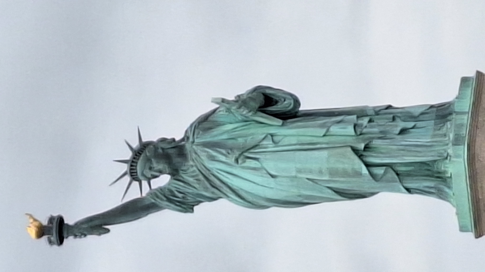
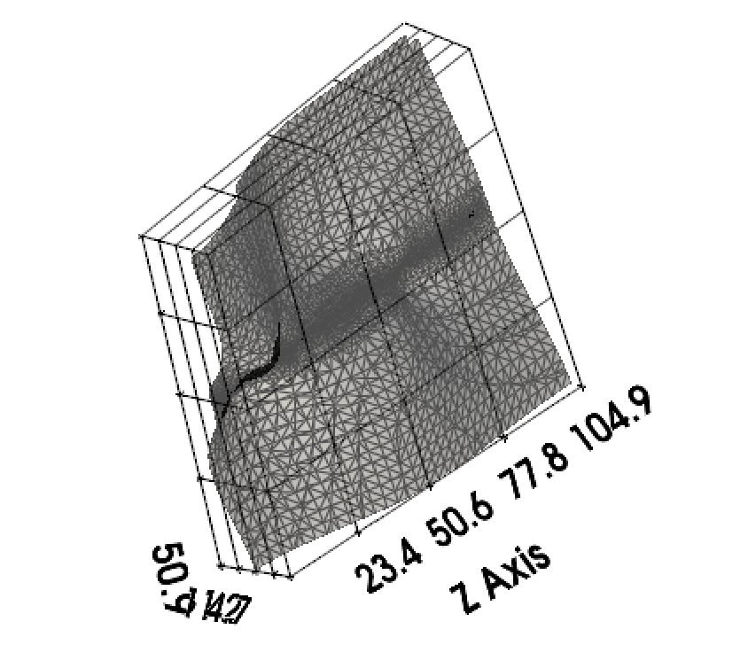

# Image to 3D Model Conversion

This project converts a 2D image into a 3D model using depth estimation and advanced mesh generation techniques. The tool supports multiple mesh generation methods, including **Poisson Surface Reconstruction** and **Ball Pivoting Algorithm (BPA)**, and provides realistic scaling, texture mapping, and detailed analysis of the 3D model.

---

## Features

- **Depth Estimation**: Uses the **DPT-Hybrid-Midas** model to estimate depth from a single 2D image.
- **Point Cloud Generation**: Converts the depth map into a 3D point cloud with real-world scaling.
- **Mesh Generation**:
  - **Poisson Surface Reconstruction**: Produces smooth surfaces suitable for organic shapes.
  - **Ball Pivoting Algorithm (BPA)**: Produces sharper surfaces suitable for objects with sharp edges.
- **Texture Mapping**: Maps the original image texture onto the 3D mesh for realistic visualization.
- **Mesh Analysis**:
  - Calculates **surface area**, **volume**, and **dimensions** (width, depth, height) of the 3D model.
  - Detects sharp edges and computes vertex normals.
- **Export 3D Model**: Exports the 3D model in `.obj`, `.stl`, or `.ply` format.
- **Interactive Visualization**: Visualizes the 3D model using **PyVista**.

---

## Requirements

- Python 3.8 or higher
- Libraries:
  - `numpy`
  - `opencv-python`
  - `Pillow`
  - `torch`
  - `torchvision`
  - `transformers`
  - `open3d`
  - `pyvista`
  - `scipy`

Install the required libraries using:

```bash
pip install numpy opencv-python Pillow torch torchvision transformers open3d pyvista scipy
```

---

## Usage

### Command-Line Arguments

The tool accepts the following command-line arguments:

| Argument            | Description                                                                 | Default Value       |
|---------------------|-----------------------------------------------------------------------------|---------------------|
| `--image_path`      | Path to the input image.                                                    | **Required**        |
| `--human_distance`  | Distance of the human from the object in the image (in meters).             | **Required**        |
| `--focal_length`    | Focal length of the camera (in pixels).                                     | `1000`              |
| `--sensor_width`    | Sensor width of the camera (in millimeters).                                | `36.0`              |
| `--export_path`     | Path to export the 3D model (e.g., `output.obj`).                           | `output.obj`        |
| `--mesh_type`       | Mesh generation method: `poisson` or `ball_pivot`.                          | `poisson`           |

### Example Commands

1. **Generate a 3D model using Poisson Surface Reconstruction**:
   ```bash
   python ./image-3d/main.py --image_path /path/to/image.jpg --human_distance 5.0 --focal_length 1000 --sensor_width 36.0 --export_path output.obj --mesh_type poisson
   ```

2. **Generate a 3D model using Ball Pivoting Algorithm (BPA)**:
   ```bash
   python main.py --image_path /path/to/image.jpg --human_distance 5.0 --focal_length 1000 --sensor_width 36.0 --export_path output.obj --mesh_type ball_pivot
   ```

3. Stand-alone single file implementations with slightly less optimized calculations are given inside `./images-3d-standalone`
---

## Output

The tool generates the following outputs:

1. **3D Model**:
   - Exported in `.obj`, `.stl`, or `.ply` format.
   - Includes texture mapping if the original image is used.

2. **Console Output**:
   - Surface area (in square meters).
   - Volume (in cubic meters, if the mesh is watertight).
   - Dimensions (width, depth, height in meters).

   Example:
   ```
   Surface Area: 25.34 m²
   Volume: 12.56 m³
   Dimensions (Width x Depth x Height): 5.00 m x 3.50 m x 2.00 m
   ```

3. **Interactive Visualization**:
   - Opens a PyVista window to interactively explore the 3D model.

### Outputs:

For `./images/liberty.jpg`, where it is assumed that the picture was taken from a distance (human_distance) of 100.0m approximately!
```
Surface Area: 12546.145062465519 m²
Dimensions (Width x Depth x Height): 25.90 m x 105.29 m x 108.68 m
```

>Note that the real height of Statue of liberty is 95m!
>Therefore, the error is roughly 11%

| JPG | 3D reconstruction |
|---------|---------|
|  |  |
| *Liberty jpg* | *Liberty mesh* |
---

## File Structure

The project is organized into the following files:

| File                | Description                                                                 |
|---------------------|-----------------------------------------------------------------------------|
| `depth_estimation.py` | Handles depth estimation using the DPT-Hybrid-Midas model.                  |
| `point_cloud.py`    | Generates a 3D point cloud from the depth map with real-world scaling.      |
| `mesh_generation.py` | Generates a 3D mesh using Poisson Surface Reconstruction or BPA.            |
| `texture_mapping.py` | Maps the original image texture onto the 3D mesh.                           |
| `mesh_analysis.py`  | Analyzes the mesh (surface area, volume, dimensions, etc.).                 |
| `export_model.py`   | Exports the 3D model in `.obj`, `.stl`, or `.ply` format.                   |
| `visualization.py`  | Visualizes the 3D model using PyVista.                                      |
| `main.py`           | The main script that ties everything together.                              |

---

## Customization

### Adjusting Mesh Sharpness

- For **Poisson Surface Reconstruction**:
  - Adjust the `depth` parameter in `mesh_generation.py` (higher values produce smoother surfaces).
- For **Ball Pivoting Algorithm (BPA)**:
  - Adjust the `radius` parameter in `mesh_generation.py` (smaller values produce sharper features).

### Adding New Features

- To add a new mesh generation method:
  1. Implement the method in `mesh_generation.py`.
  2. Update the `MeshGenerator` class to support the new method.
  3. Add the method to the `--mesh_type` argument in `main.py`.

---

## Troubleshooting

### 1. **Unrealistic Dimensions**
   - Ensure the `--human_distance`, `--focal_length`, and `--sensor_width` parameters are set correctly.
   - Verify that the depth map is properly scaled.

### 2. **Mesh Not Watertight**
   - Use the `remove_non_manifold_edges` and `remove_degenerate_triangles` methods in `mesh_generation.py` to clean the mesh.
   - If the mesh is still not watertight, consider using a different mesh generation method.

### 3. **Open3D Warnings**
   - Warnings about triangle normals in the OBJ file are harmless and can be suppressed by setting `write_vertex_normals=True` in `export_model.py`.

---

## License

This project is licensed under the MIT License. See the [LICENSE](LICENSE) file for details.

---

## Acknowledgments

- **DPT-Hybrid-Midas Model**: Provided by Intel for depth estimation.
- **Open3D**: Used for advanced mesh generation and analysis.
- **PyVista**: Used for interactive 3D visualization.

---

## Contact

For questions or feedback, please contact:
- **Your Name**: [your.email@example.com](mailto:your.email@example.com)
- **GitHub Repository**: [https://github.com/yourusername/image-to-3d](https://github.com/yourusername/image-to-3d)
